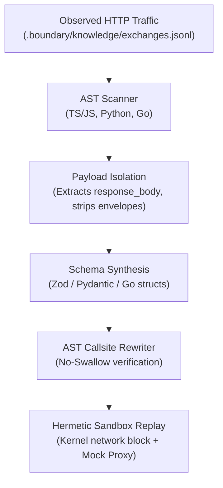

# Boundary

Autonomous Runtime Boundary Defense and Polyglot Schema Synthesis

   

When external API payloads change or drift, applications crash in production. Boundary inspects codebase ASTs for unvalidated external calls, isolates HTTP response bodies from telemetry envelopes, synthesizes typed contracts (Zod, Pydantic, Go structs), patches callsites, and validates the result inside a network-isolated sandbox.

```bash
pip install boundary

# 1. Scan for unvalidated external boundaries
boundary scan

# 2. Synthesize typed schemas and patch callsites
boundary resolve --target src/api_client.ts

# 3. Block unvalidated commits and verify repairs
boundary guard
boundary verify
```

[Quickstart](docs/QUICKSTART.md) | [CLI Reference](docs/CLI.md) | [Architecture](docs/ARCHITECTURE.md) | [Ghost Proxy](docs/GHOST_PROXY.md)

---

## The Problem

Every application depends on external services: payment gateways, AI providers, and third-party REST APIs. Three failure modes recur across codebases:

1. **Unvalidated Boundaries**: Network calls cast JSON payloads to `any`, untyped dictionaries, or unchecked structs. When an upstream provider modifies a key or changes nullability, code crashes at downstream access points.
2. **Context Leakage**: Generating schemas from raw telemetry envelopes causes models to incorporate transport metadata (`request_method`, `request_headers`) rather than the actual API response object.
3. **Silent Error Swallowing**: Automated patches that wrap calls in silent `try/catch` or `except: pass` blocks pass tests in development but discard critical runtime errors in production.

Boundary addresses all three through static AST inspection, pure payload isolation, and sandboxed replay.

---

## How It Works



### 1. Multi-Language Boundary Scanning (`boundary scan`)

Scans repository source trees across TypeScript, JavaScript, Python, and Go for external HTTP callsites lacking runtime validation:

- **TypeScript / JavaScript**: Unchecked `fetch()`, `axios.get()`, `axios.post()`, or `as any` casts.
- **Python**: Unvalidated `requests.get()`, `httpx.get()`, `aiohttp`, and unmodeled `.json()` access.
- **Go**: Unvalidated `http.Get()`, `http.Post()`, `client.Do()`, and unchecked JSON unmarshaling.

```bash
boundary scan
```

### 2. Payload Isolation and Schema Synthesis (`boundary resolve`)

Extracts observed payloads and generates typed schemas without transport noise:

- **Payload Isolation**: Extracts solely `response_body` from telemetry clusters. Transport wrappers like `request_headers` and `response_status` are discarded.
- **Single-Sample Unwrapping**: Unwraps single samples into clean root objects to avoid double-slice/array generation.
- **No-Swallow Verification**: Injects validation (`.parse()`, `model_validate()`) directly at the callsite. The AST rewriter rejects patches that catch validation errors silently (`catch { return null; }` or `except Exception: pass`).

```bash
# Resolve all unvalidated boundaries
boundary resolve

# Resolve a specific file
boundary resolve --target src/resend.ts
```

### 3. Hermetic Sandbox Replay (`boundary verify`)

Runs your existing test suite inside an isolated sandbox using macOS `sandbox-exec` or Linux `landlock`:

- Outbound socket connections to the public internet are blocked at the OS kernel level.
- Outbound requests are intercepted via the local mock proxy (`127.0.0.1:54321`), serving recorded `HttpExchange` responses.
- Tests pass only when newly synthesized schemas parse recorded payloads with zero unhandled exceptions.

```bash
boundary verify
```

### 4. Pre-Commit Verification (`boundary guard`)

Runs as a pre-commit hook to prevent unvalidated network calls from entering source control:

```bash
# Install hook
boundary guard --install

# Execute manual check against staged files
boundary guard
```

---

## Supported Ecosystems

| Language | Client Libraries | Generated Schema Type | Validation Target |
| :--- | :--- | :--- | :--- |
| **TypeScript / JS** | `fetch`, `axios`, `@boundary/nextjs` | `z.object({...})` | [Zod](https://zod.dev) |
| **Python** | `requests`, `httpx`, `aiohttp` | `class Schema(BaseModel):` | [Pydantic v2](https://docs.pydantic.dev) |
| **Go** | `net/http`, `http.Client` | `type Schema struct` with JSON tags | Standard Library |

---

## Architecture

Boundary combines a native Rust engine for AST transformations and kernel sandboxing with Python for orchestration and schema synthesis:

- **`src/engines/rewriter.rs`**: AST-driven callsite rewriter injecting schema imports and validation calls.
- **`src/engines/graph/`**: Dependency graph mapping external providers, manifests, and AST callsites.
- **`src/sandbox/`**: OS-level network and filesystem isolation (macOS Seatbelt, Linux Landlock).
- **`python/boundary/hunt.py`**: Schema synthesis loop with payload isolation and No-Swallow AST verifier.
- **`python/boundary/sandbox/proxy.py`**: Interception proxy routing mock payloads during test execution.
- **`sdk/typescript/instrument.js`**: Node.js and fetch shim redirecting sandboxed traffic to the mock proxy.

---

## License

Boundary is licensed under the [Apache License, Version 2.0](LICENSE).
