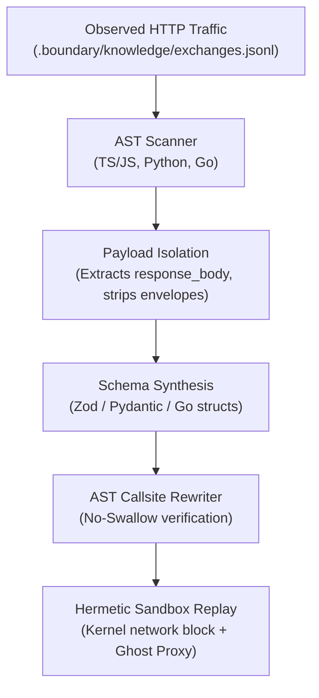

# Bergendy

Runtime schemas, drafted from your live traffic.

APIs change. Bergendy watches what your app actually receives,
drafts Zod / Pydantic / Go schemas for it, patches your callsites,
and proves the result in a sandboxed replay. No network, no side effects.

```bash
pip install bergendy

bergendy init
bergendy see          # what's open
bergendy fix          # draft + patch + prove, in one step
bergendy watch        # keep it clean on main
```

## Four verbs. That's the product.

- **See** — every external call and the real payload it returns.
- **Draft** — typed schemas, named after the resource, not the URL.
- **Patch** — rewrite callsites cleanly. AST-driven, no reformatting.
- **Prove** — replay captured traffic inside a Ghost Proxy sandbox.

Plus one passive mode: **Watch** — keep unguarded calls off `main`.

---

## The Problem

Every application depends on external services: payment gateways, AI providers, and third-party REST APIs. Three failure modes recur across codebases:

1. **Open Calls**: Network calls cast JSON payloads to `any`, untyped dictionaries, or unchecked structs. When an upstream provider modifies a key or changes nullability, code crashes at downstream access points.
2. **Context Leakage**: Generating schemas from raw telemetry envelopes causes models to incorporate transport metadata (`request_method`, `request_headers`) rather than the actual API response object.
3. **Silent Error Swallowing**: Automated patches that wrap calls in silent `try/catch` or `except: pass` blocks pass tests in development but discard critical runtime errors in production.

Bergendy addresses all three through static AST inspection, pure payload isolation, and sandboxed replay.

---

## How It Works



### 1. See Open Calls (`bergendy see`)

Scans repository source trees across TypeScript, JavaScript, Python, and Go for external HTTP callsites lacking runtime validation:

- **TypeScript / JavaScript**: Unchecked `fetch()`, `axios.get()`, `axios.post()`, or `as any` casts.
- **Python**: Unvalidated `requests.get()`, `httpx.get()`, `aiohttp`, and unmodeled `.json()` access.
- **Go**: Unvalidated `http.Get()`, `http.Post()`, `client.Do()`, and unchecked JSON unmarshaling.

```bash
bergendy see
```

### 2. Draft and Patch Callsites (`bergendy fix`)

Extracts observed payloads and generates typed schemas without transport noise:

- **Resource-Based Naming**: Files use clean `snake_case` naming and exports use `PascalCase` ending in `Schema` (e.g. `stripe_payment_intent.ts` exports `StripePaymentIntentSchema`), never URL slugs.
- **Pure Payload Isolation**: Isolates response bodies from telemetry clusters. Transport wrappers like headers and status codes are discarded.
- **No-Swallow Verification**: Injects validation (`.parse()`, `model_validate()`) directly at the callsite. The AST rewriter rejects patches that catch validation errors silently.

```bash
# Fix all open calls in a guided workflow
bergendy fix

# Target a specific file
bergendy fix --target src/resend.ts
```

### 3. Prove with Ghost Proxy (`bergendy prove`)

Runs your existing test suite inside an isolated sandbox using macOS `sandbox-exec` or Linux `landlock`:

- Outbound socket connections to the public internet are blocked at the OS kernel level.
- Outbound requests are intercepted via the local Ghost Proxy (`127.0.0.1:54321`), serving recorded exchanges.
- Tests pass only when newly synthesized schemas parse recorded payloads with zero unhandled exceptions.

```bash
bergendy prove
```

### 4. Watch Main (`bergendy watch`)

Runs as a pre-commit hook to prevent unguarded network calls from entering source control:

```bash
# Install hook
bergendy watch --install

# Execute check against staged files
bergendy watch
```

---

## Supported Ecosystems

| Language | Client Libraries | Generated Schema Type | Validation Target |
| :--- | :--- | :--- | :--- |
| **TypeScript / JS** | `fetch`, `axios`, `@bergendy/nextjs` | `z.object({...})` | [Zod](https://zod.dev) |
| **Python** | `requests`, `httpx`, `aiohttp` | `class Schema(BaseModel):` | [Pydantic v2](https://docs.pydantic.dev) |
| **Go** | `net/http`, `http.Client` | `type Schema struct` with JSON tags | Standard Library |

---

## Architecture

Bergendy combines a native Rust engine for AST transformations and kernel sandboxing with Python for orchestration and schema synthesis:

- **`src/engines/rewriter.rs`**: AST-driven callsite rewriter injecting schema imports and validation calls.
- **`src/engines/graph/`**: Dependency graph mapping external providers, manifests, and AST callsites.
- **`src/sandbox/`**: OS-level network and filesystem isolation (macOS Seatbelt, Linux Landlock).
- **`src/ghost_proxy/server.rs`**: Local Axum-based mock HTTP server serving recorded exchanges in hermetic sandboxes.
- **`python/bergendy/hunt.py`**: Schema synthesis loop with payload isolation and No-Swallow AST verifier.
- **`sdk/typescript/instrument.js`**: Node.js and fetch shim redirecting sandboxed traffic to the mock proxy.

---

## License

Bergendy is licensed under the [Apache License, Version 2.0](LICENSE).

