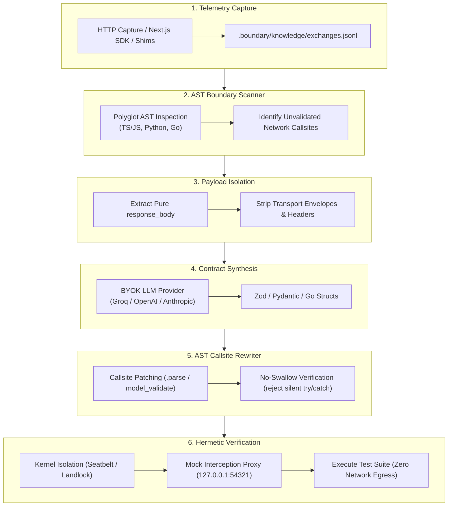

# Bergendy System Architecture

Bergendy detects unguarded runtime boundaries, synthesizes rigid schemas from observed HTTP traffic, patches callsites using native AST rewrites, and verifies repairs in a network-isolated kernel sandbox.

---

## 1. System Pipeline



---

## 2. Core Components

### A. Static AST Boundary Scanner (`src/engines/ast/`, `python/bergendy/runtime_scan.py`)
Scans source files across supported languages:
* **TypeScript / JavaScript**: Tracks `fetch()`, `axios` invocations, and unsafe `as any` type assertions.
* **Python**: Identifies unmodeled `requests.get()`, `httpx.get()`, `aiohttp`, and raw dictionary indexing on JSON outputs.
* **Go**: Inspects `http.Get()`, `http.Post()`, and `client.Do()` calls lacking typed unmarshaling.

### B. Payload Isolation Engine (`python/bergendy/hunt.py`)
Isolates payload data to prevent context leakage:
* Telemetry envelopes often contain transport wrappers (`request_method`, `request_headers`, `response_status`).
* Bergendy strips all envelope fields, feeding only `exchange.response_body` to the schema synthesizer.
* Unwraps single samples to generate root object structures instead of unwanted array wrappers.

### C. AST Context Extractor (`src/engines/context_extractor.rs`)
Extracts targeted structural context around each callsite without full file dumps:
* Locates enclosing function signature, parameter types, and function body.
* Builds precise data-flow chains from HTTP callsite to response consumption.
* Detects existing error handling patterns (`try/catch`, `.catch()`, custom handlers).
* Gathers existing file-level imports to prevent duplicate or conflicting declarations.

### D. 6-Point Deterministic AST Verifier (`src/engines/ast_verifier.rs`)
Validates candidate patches using 6 safety checks:
1. **Syntactic Balance**: Balanced braces, parentheses, quotes, and backticks.
2. **Schema Wiring**: Verifies `.parse()` or `model_validate()` is wired directly to the response data flow.
3. **No-Swallow Rule**: Rejects silent `catch` or `except: pass` blocks; errors must bubble to application handlers.
4. **Blast Radius Preservation**: Ensures changes stay strictly within the enclosing function without corrupting outer lines or declarations.
5. **Import Correctness**: Validates import statement syntax and target specifier.
6. **Resource Naming Conventions**: Enforces `snake_case` filenames and `PascalCase` exports ending in `Schema`.

### E. Polyglot AST Rewriter (`src/engines/rewriter.rs`)
Performs code rewrites at the AST level:
* Injects schema imports at the top of the file.
* Rewrites raw `.then(r => r.json())` into `.then(r => r.json()).then(data => Schema.parse(data))`.
* Rewrites `const data = await res.json()` into `const data = Schema.parse(await res.json())`.
* Provides robust zero-token deterministic rewriting when running offline or without AI keys.

### F. Hermetic Sandbox and Interception Proxy (`src/sandbox/`, `src/ghost_proxy/`, `sdk/typescript/instrument.js`)
Guarantees zero external network dependencies during verification:
* **Kernel Sandbox**: macOS Seatbelt (`sandbox-exec`) or Linux Landlock blocks public internet sockets.
* **Mock Interception Proxy**: Serves canned `HttpExchange` responses on loopback (`127.0.0.1:54321`).
* **Test Verification**: Runs the project's native test commands (`pytest`, `npm test`, `go test ./...`). Tests pass only when synthesized contracts parse recorded payloads without error.

---

## 3. Directory Layout on Disk

```text
.boundary/
  knowledge/
    exchanges.jsonl       Recorded HTTP telemetry exchanges
  contracts/              Synthesized schemas (Zod, Pydantic, Go structs)
  graph.json              Static dependency callsite map
```
