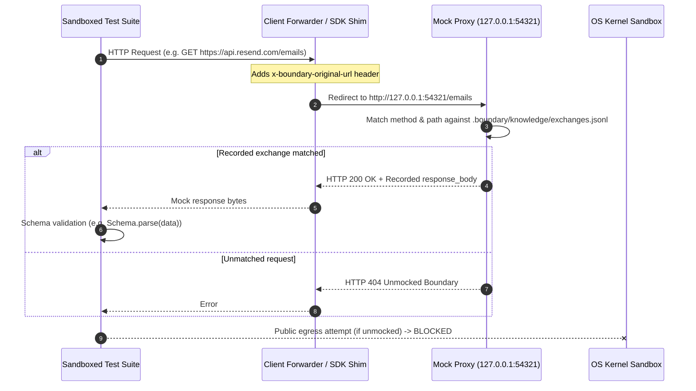

# Ghost Proxy: Mock Interception and Hermetic Sandbox Replay

Bergendy uses a local mock proxy and kernel-level network sandboxing to replay recorded HTTP exchanges, enabling deterministic, offline verification of synthesized schemas.

---

## 1. Why Sandbox Replay?

When Bergendy generates runtime validation schemas (such as Zod schemas or Pydantic models) and patches callsites, it verifies that the repaired code executes and parses real API payloads without throwing errors.

Testing against live external APIs during automated repair introduces major issues:
1. Production API credentials are required and may incur costs.
2. Third-party services can throttle, rate-limit, or fail transiently.
3. Network calls introduce non-deterministic execution.

Bergendy isolates test execution using OS-level kernel isolation (macOS Seatbelt / Linux Landlock) while routing external HTTP requests to the local mock proxy (`127.0.0.1:54321`).

---

## 2. Architecture and Request Flow

---

## 3. Isolation Guarantees

* **Zero Network Egress**: The OS kernel blocks outbound TCP/UDP sockets to external hosts during `bergendy prove`.
* **Payload Fidelity**: The proxy serves the captured `response_body` bytes matching recorded production traffic.
* **Fail-Closed Verification**: If code attempts to access unrecorded endpoints, the proxy rejects the call with `404 Unmocked Boundary`, ensuring no untested network paths succeed silently.

